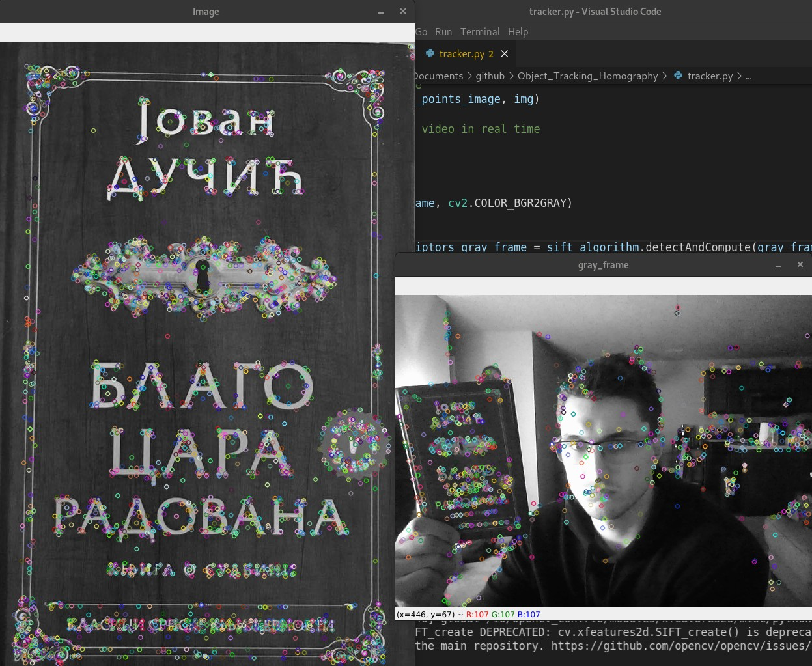
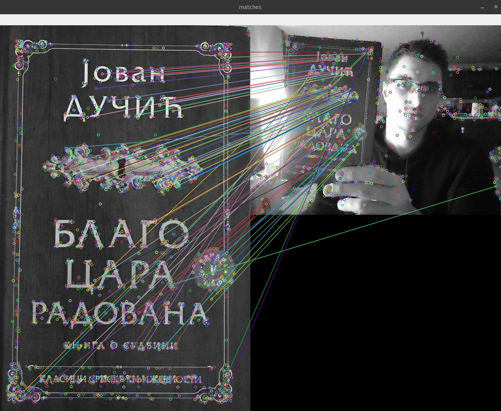
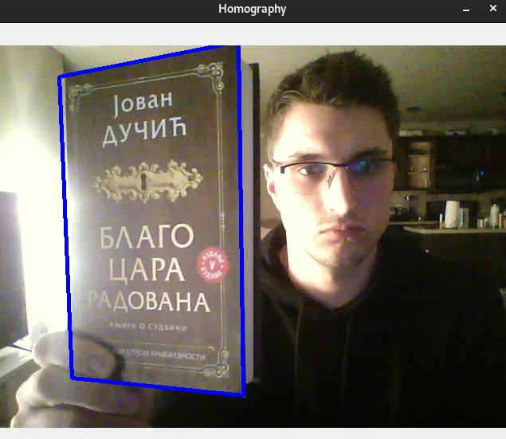
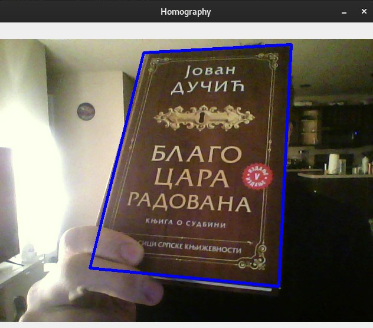

# Object_Tracking_Homography
Tracking the object using its features and homography.

In this project, we will:

1. detect features of an object from the original image in our live stream video,
2. connect the features from the original image and features on the live stream video with colored lines,
3. detect the object using homography.

# How to run

$python3 tracker.py Radovan.jpg

As a second commandline argument provide the name of the image to be detected. The image should be stored in **images** folder.

# Results

# Detecting the features of the image:

# Matching the features with colored lines:

# Object detection using homography:

